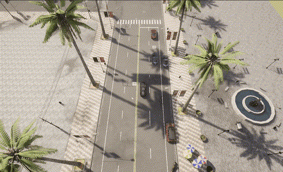
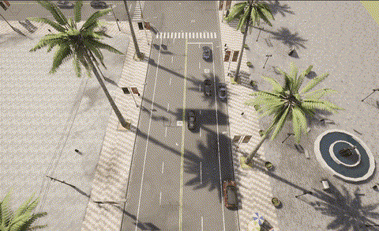
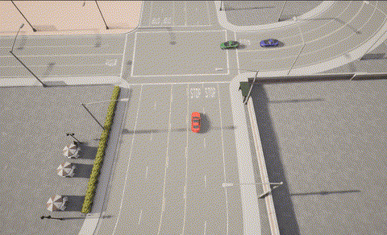
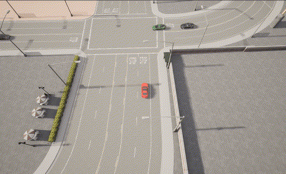

# PC-HMD

Official implementation for **Physically Consistent Diffusion Planning with
Hybrid Memory: An Adaptive Framework for Urban Autonomous Driving**.

PC-HMD is a diffusion-policy planning framework for unsignalized urban driving
in CARLA. This release includes the model code, CARLA environments, route
assets, and demonstration videos.

## Demonstration Videos

### Town10

Town10HD unsignalized intersection environment.

**Demo 1.** The ego vehicle yields in complex traffic and then finds a gap to
pass.



**Demo 2.** The ego vehicle waits through dense interaction and completes the
turn when the route becomes clear.



### Town03

Town03 unsignalized intersection environment.

**Demo 1.** The ego vehicle yields to the green car while the blue car slows
down, then passes through the intersection.



**Demo 2.** The ego vehicle cannot pass first and yields to the green and black
cars.



### Town05

Town05 unsignalized intersection environment.

**Demo 1.** The ego vehicle yields to the green car and then passes quickly.


**Demo 2.** The ego vehicle yields to the purple car first, then yields to the
green and blue cars.


**Demo 3.** The purple car slows down, allowing the ego vehicle to pass first.


## Repository Layout

```text
PC-HMD/
  agent/       Policy rollout agents
  cfg/         Hydra configs
  env/         CARLA environments and Town10 route assets
  model/       Diffusion policy, encoder, and critic modules
  script/      Runtime entrypoint
  video/       Demonstration videos
```

## Installation

The code was tested with Linux, Python 3.8, CARLA 0.9.12, and a CUDA-capable
GPU.

```bash
git clone <this-repository-url>
cd <this-repository>

conda create -n pc-hmd python=3.8 -y
conda activate pc-hmd
pip install -r requirements.txt
```

Install CARLA 0.9.12 and export its root directory:

```bash
export CARLA_ROOT=/path/to/CARLA_0.9.12
```

## Run

```bash
python script/run.py
```

Adaptive inference:

```bash
python script/run.py --config-name adaptive
```

## Acknowledgements

We thank [Scene-Rep-Transformer](https://github.com/georgeliu233/Scene-Rep-Transformer)
for the CARLA scenarios and baseline, and
[DPPO](https://github.com/irom-princeton/dppo) and
[ddiffpg](https://github.com/supersglzc/ddiffpg) for the diffusion-policy
baselines.
